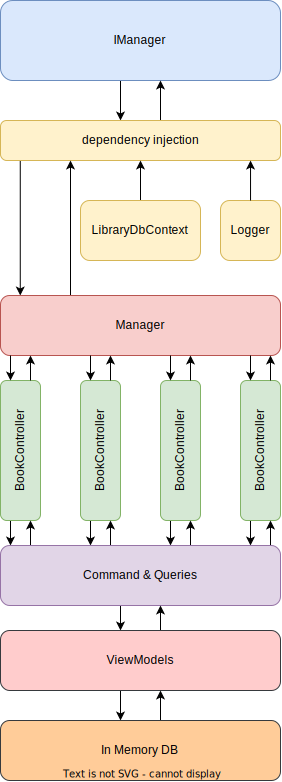

@import "https://fonts.googleapis.com/css2?family=Poppins:wght@300;500;700&display=swap";

# Kütüphane Uygulaması

Bu projede 1. haftada istenen ödeve karşılık bir konsol uygulaması olarak kütüphane yönetim sistemi geliştirilmiştir. Projede güncel teknolojilerden;
 
- AutoMapper" Version=12.0.1
- AutoMapper.Extensions.Microsoft.DependencyInjection Version=12.0.1
- FluentValidation Version=11.8.1
- EntityFrameworkCore Version=7.0.14
- EntityFrameworkCore.InMemory Version=7.0.14
- DependencyInjection Version=8.0.0
- Hosting Version=8.0.0

kullanılmıştır.   

 

Projede sınıflar, 
Host
 sınıfına ait 
CreateDefaultBuilder().ConfigureServices()
 metoduyla bir servis konfigüre edilimiş ve bağımlılıkardan dependency injection ile kurtarılmıştır.  
Konfigürasyondan sonra 
.Build()
 metodu ile host build edilip 
.Services.GetReqiredServices&lt;T	&gt;()
 metoduyla IManager arayüzünden kütüphane yönetim sınıfı Manager'a erişilmiştir. Projenin işleyiş şeması aşağıdaki gibidir.

Uygulamada içerisinde veriler bir InMemory DB oluşturularak orada saklandı. İçerideki hazır veriler rasgele "https://www.mockaroo.com/" adresinden oluşturuldu. Çalışmada,Manager > Conrollers > Queries/Commands > DB şeklinde bir hiyerarşik yapı oluşturulması hedeflendi.

</img>

## Ekran görüntüleri

Menüler içerisinden okunabilirlik için sadece bazıları koyulmuştur.

###### Ana Ekran
</img>
###### Ödünç alma ekranı
</img>
###### Ödünç alma kayıtları
</img>
###### Kayıtlı kitaplar listesi
</img>
###### Üye Aktif/Pasif yapma ekranı
</img>
###### Yazarlar listesi
</img>
###### Ödünç alma ekranı