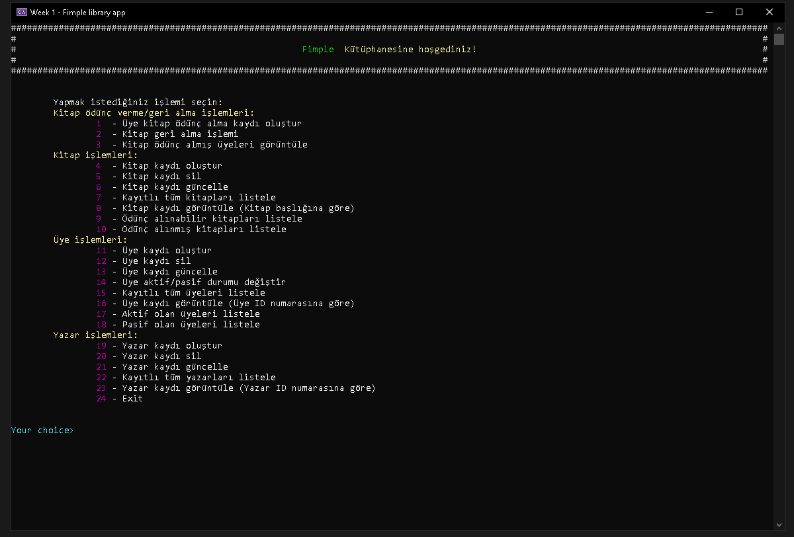
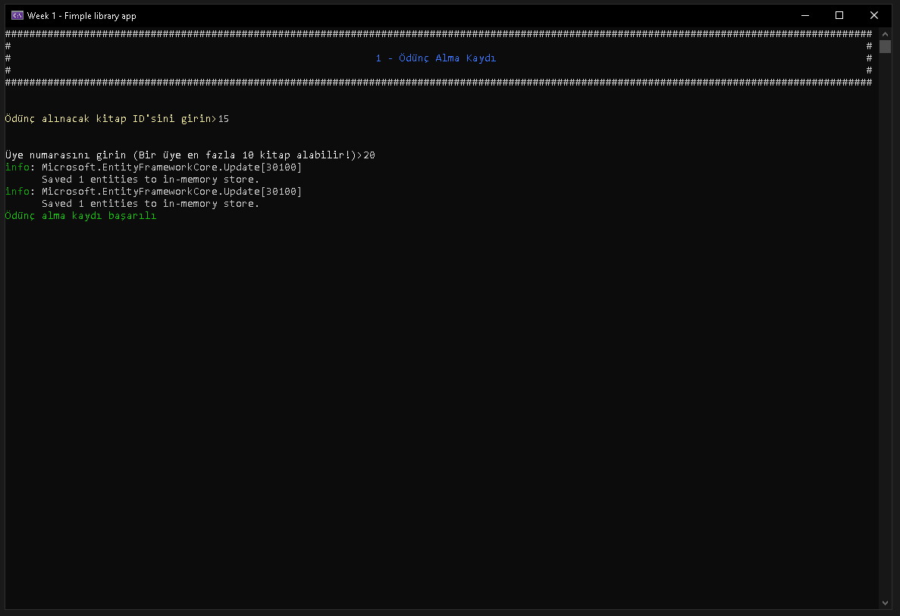
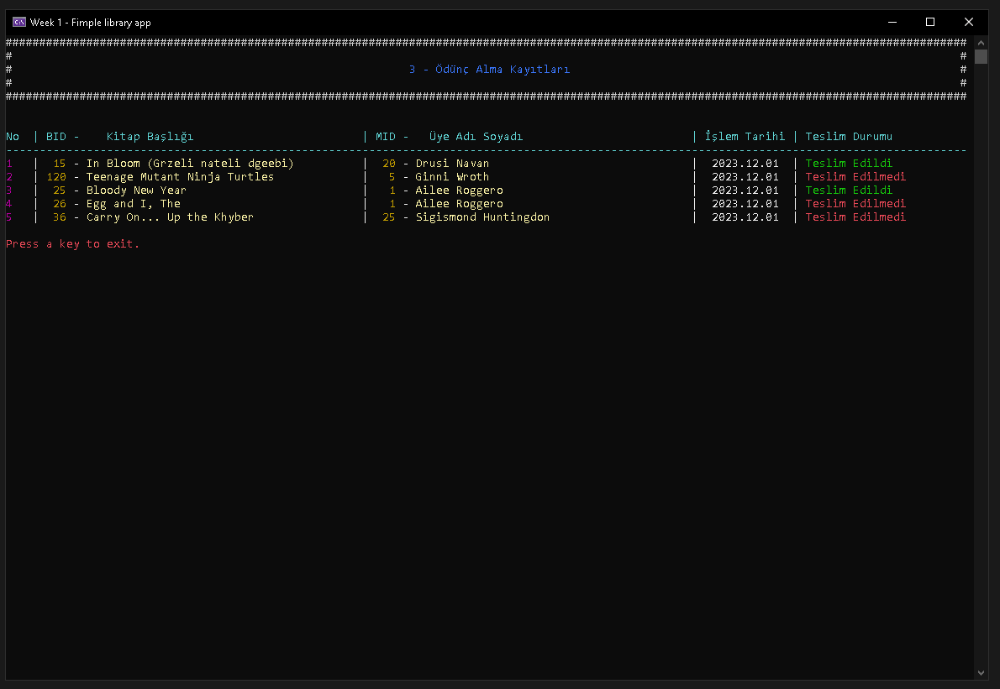
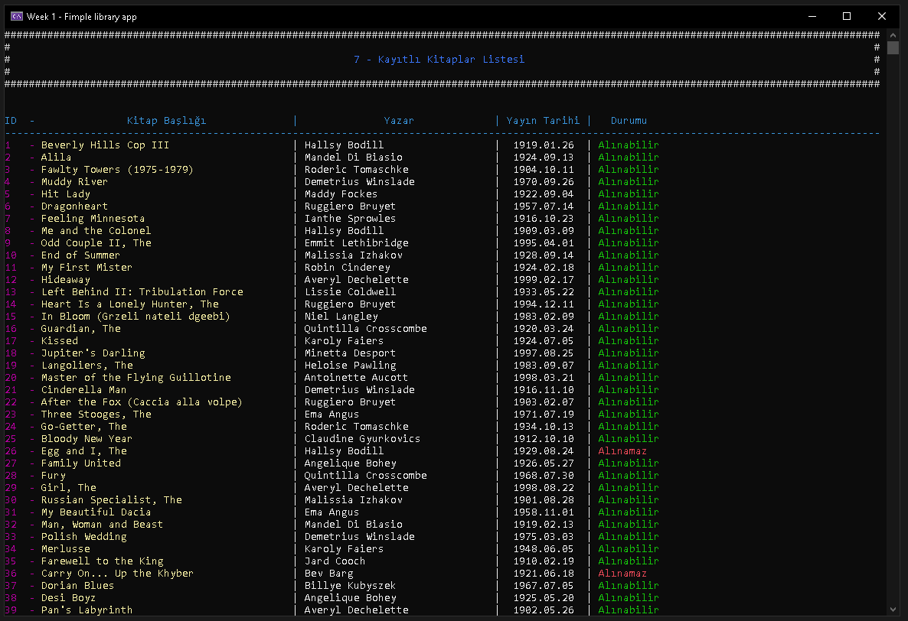
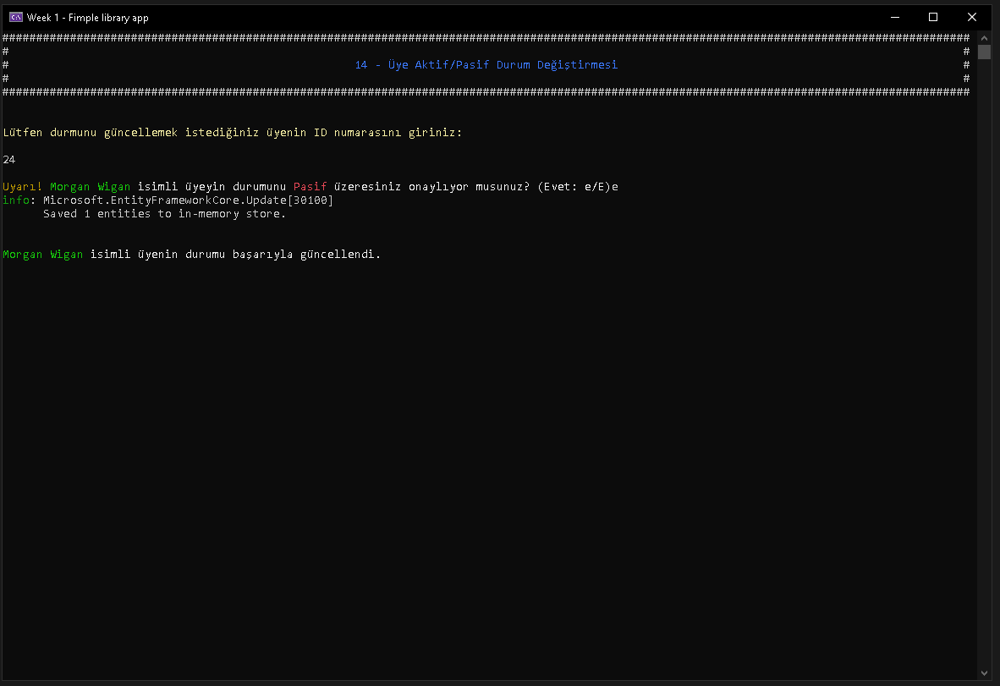
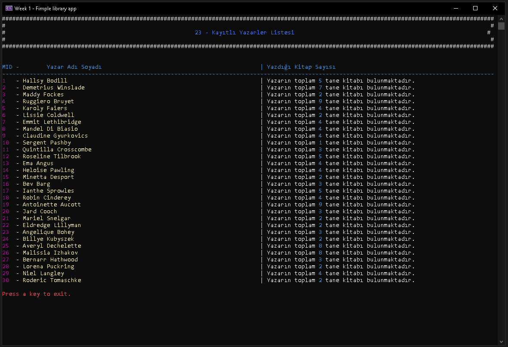

@import "https://fonts.googleapis.com/css2?family=Poppins:wght@300;500;700&display=swap";

# Kütüphane Uygulaması

Bu projede 1. haftada istenen ödeve karşılık bir konsol uygulaması olarak kütüphane yönetim sistemi geliştirilmiştir. Projede güncel teknolojilerden;
 
- AutoMapper" Version=12.0.1
- AutoMapper.Extensions.Microsoft.DependencyInjection Version=12.0.1
- FluentValidation Version=11.8.1
- EntityFrameworkCore Version=7.0.14
- EntityFrameworkCore.InMemory Version=7.0.14
- DependencyInjection Version=8.0.0
- Hosting Version=8.0.0

kullanılmıştır.   

 

Projede sınıflar, 
Host
 sınıfına ait 
CreateDefaultBuilder().ConfigureServices()
 metoduyla bir servis konfigüre edilimiş ve bağımlılıkardan dependency injection ile kurtarılmıştır.  
Konfigürasyondan sonra 
.Build()
 metodu ile host build edilip 
.Services.GetReqiredServices&lt;T	&gt;()
 metoduyla IManager arayüzünden kütüphane yönetim sınıfı Manager'a erişilmiştir. Projenin işleyiş şeması aşağıdaki gibidir.

Uygulamada içerisinde veriler bir InMemory DB oluşturularak orada saklandı. İçerideki hazır veriler rasgele "https://www.mockaroo.com/" adresinden oluşturuldu. Çalışmada,Manager > Conrollers > Queries/Commands > DB şeklinde bir hiyerarşik yapı oluşturulması hedeflendi.

<svg xmlns="http://www.w3.org/2000/svg" xmlns:xlink="http://www.w3.org/1999/xlink" version="1.1" width="282px" viewBox="-0.5 -0.5 282 782" content="&lt;mxfile host=&quot;app.diagrams.net&quot; modified=&quot;2023-12-01T19:45:46.702Z&quot; agent=&quot;Mozilla/5.0 (Windows NT 10.0; Win64; x64) AppleWebKit/537.36 (KHTML, like Gecko) Chrome/119.0.0.0 Safari/537.36&quot; etag=&quot;Xv4LKgS4k27-eL0GkDnI&quot; version=&quot;22.1.5&quot; type=&quot;google&quot;&gt;&#10;  &lt;diagram name=&quot;Sayfa -1&quot; id=&quot;KNbZZmwNg6sT4pyXqSYw&quot;&gt;&#10;    &lt;mxGraphModel dx=&quot;877&quot; dy=&quot;505&quot; grid=&quot;1&quot; gridSize=&quot;10&quot; guides=&quot;1&quot; tooltips=&quot;1&quot; connect=&quot;1&quot; arrows=&quot;1&quot; fold=&quot;1&quot; page=&quot;1&quot; pageScale=&quot;1&quot; pageWidth=&quot;827&quot; pageHeight=&quot;1169&quot; math=&quot;0&quot; shadow=&quot;0&quot;&gt;&#10;      &lt;root&gt;&#10;        &lt;mxCell id=&quot;0&quot; /&gt;&#10;        &lt;mxCell id=&quot;1&quot; parent=&quot;0&quot; /&gt;&#10;        &lt;mxCell id=&quot;IJN3HlDoYffcYIdxOyTI-61&quot; value=&quot;&quot; style=&quot;edgeStyle=orthogonalEdgeStyle;rounded=0;orthogonalLoop=1;jettySize=auto;html=1;strokeWidth=2;fillColor=#f5f5f5;strokeColor=#666666;&quot; edge=&quot;1&quot; parent=&quot;1&quot; source=&quot;IJN3HlDoYffcYIdxOyTI-1&quot; target=&quot;IJN3HlDoYffcYIdxOyTI-2&quot;&gt;&#10;          &lt;mxGeometry relative=&quot;1&quot; as=&quot;geometry&quot;&gt;&#10;            &lt;Array as=&quot;points&quot;&gt;&#10;              &lt;mxPoint x=&quot;280&quot; y=&quot;150&quot; /&gt;&#10;              &lt;mxPoint x=&quot;280&quot; y=&quot;150&quot; /&gt;&#10;            &lt;/Array&gt;&#10;          &lt;/mxGeometry&gt;&#10;        &lt;/mxCell&gt;&#10;        &lt;mxCell id=&quot;IJN3HlDoYffcYIdxOyTI-1&quot; value=&quot;IManager&quot; style=&quot;rounded=1;whiteSpace=wrap;html=1;fillColor=#eeeeee;strokeColor=#36393d;&quot; vertex=&quot;1&quot; parent=&quot;1&quot;&gt;&#10;          &lt;mxGeometry x=&quot;160&quot; y=&quot;40&quot; width=&quot;280&quot; height=&quot;80&quot; as=&quot;geometry&quot; /&gt;&#10;        &lt;/mxCell&gt;&#10;        &lt;mxCell id=&quot;IJN3HlDoYffcYIdxOyTI-4&quot; value=&quot;&quot; style=&quot;edgeStyle=orthogonalEdgeStyle;rounded=0;orthogonalLoop=1;jettySize=auto;html=1;strokeWidth=2;fillColor=#f5f5f5;strokeColor=#666666;&quot; edge=&quot;1&quot; parent=&quot;1&quot; source=&quot;IJN3HlDoYffcYIdxOyTI-2&quot; target=&quot;IJN3HlDoYffcYIdxOyTI-1&quot;&gt;&#10;          &lt;mxGeometry relative=&quot;1&quot; as=&quot;geometry&quot;&gt;&#10;            &lt;Array as=&quot;points&quot;&gt;&#10;              &lt;mxPoint x=&quot;320&quot; y=&quot;130&quot; /&gt;&#10;              &lt;mxPoint x=&quot;320&quot; y=&quot;130&quot; /&gt;&#10;            &lt;/Array&gt;&#10;          &lt;/mxGeometry&gt;&#10;        &lt;/mxCell&gt;&#10;        &lt;mxCell id=&quot;IJN3HlDoYffcYIdxOyTI-62&quot; style=&quot;edgeStyle=orthogonalEdgeStyle;rounded=0;orthogonalLoop=1;jettySize=auto;html=1;entryX=0.5;entryY=0;entryDx=0;entryDy=0;strokeWidth=2;fillColor=#dae8fc;strokeColor=#6c8ebf;&quot; edge=&quot;1&quot; parent=&quot;1&quot;&gt;&#10;          &lt;mxGeometry relative=&quot;1&quot; as=&quot;geometry&quot;&gt;&#10;            &lt;mxPoint x=&quot;179.76&quot; y=&quot;200&quot; as=&quot;sourcePoint&quot; /&gt;&#10;            &lt;mxPoint x=&quot;179.76&quot; y=&quot;335&quot; as=&quot;targetPoint&quot; /&gt;&#10;          &lt;/mxGeometry&gt;&#10;        &lt;/mxCell&gt;&#10;        &lt;mxCell id=&quot;IJN3HlDoYffcYIdxOyTI-2&quot; value=&quot;dependency injection&quot; style=&quot;whiteSpace=wrap;html=1;rounded=1;fillColor=#cce5ff;strokeColor=#36393d;&quot; vertex=&quot;1&quot; parent=&quot;1&quot;&gt;&#10;          &lt;mxGeometry x=&quot;160&quot; y=&quot;160&quot; width=&quot;280&quot; height=&quot;40&quot; as=&quot;geometry&quot; /&gt;&#10;        &lt;/mxCell&gt;&#10;        &lt;mxCell id=&quot;IJN3HlDoYffcYIdxOyTI-59&quot; value=&quot;&quot; style=&quot;edgeStyle=orthogonalEdgeStyle;rounded=0;orthogonalLoop=1;jettySize=auto;html=1;strokeWidth=2;fillColor=#dae8fc;strokeColor=#6c8ebf;&quot; edge=&quot;1&quot; parent=&quot;1&quot; source=&quot;IJN3HlDoYffcYIdxOyTI-9&quot; target=&quot;IJN3HlDoYffcYIdxOyTI-2&quot;&gt;&#10;          &lt;mxGeometry relative=&quot;1&quot; as=&quot;geometry&quot; /&gt;&#10;        &lt;/mxCell&gt;&#10;        &lt;mxCell id=&quot;IJN3HlDoYffcYIdxOyTI-9&quot; value=&quot;LibraryDbContext&quot; style=&quot;whiteSpace=wrap;html=1;rounded=1;fillColor=#cce5ff;strokeColor=#36393d;&quot; vertex=&quot;1&quot; parent=&quot;1&quot;&gt;&#10;          &lt;mxGeometry x=&quot;240&quot; y=&quot;240&quot; width=&quot;120&quot; height=&quot;60&quot; as=&quot;geometry&quot; /&gt;&#10;        &lt;/mxCell&gt;&#10;        &lt;mxCell id=&quot;IJN3HlDoYffcYIdxOyTI-11&quot; value=&quot;Logger&quot; style=&quot;whiteSpace=wrap;html=1;rounded=1;fillColor=#cce5ff;strokeColor=#36393d;&quot; vertex=&quot;1&quot; parent=&quot;1&quot;&gt;&#10;          &lt;mxGeometry x=&quot;380&quot; y=&quot;240&quot; width=&quot;60&quot; height=&quot;60&quot; as=&quot;geometry&quot; /&gt;&#10;        &lt;/mxCell&gt;&#10;        &lt;mxCell id=&quot;IJN3HlDoYffcYIdxOyTI-63&quot; style=&quot;edgeStyle=orthogonalEdgeStyle;rounded=0;orthogonalLoop=1;jettySize=auto;html=1;entryX=0.25;entryY=1;entryDx=0;entryDy=0;strokeWidth=2;fillColor=#dae8fc;strokeColor=#6c8ebf;&quot; edge=&quot;1&quot; parent=&quot;1&quot; source=&quot;IJN3HlDoYffcYIdxOyTI-13&quot; target=&quot;IJN3HlDoYffcYIdxOyTI-2&quot;&gt;&#10;          &lt;mxGeometry relative=&quot;1&quot; as=&quot;geometry&quot;&gt;&#10;            &lt;Array as=&quot;points&quot;&gt;&#10;              &lt;mxPoint x=&quot;230&quot; y=&quot;300&quot; /&gt;&#10;              &lt;mxPoint x=&quot;230&quot; y=&quot;300&quot; /&gt;&#10;            &lt;/Array&gt;&#10;          &lt;/mxGeometry&gt;&#10;        &lt;/mxCell&gt;&#10;        &lt;mxCell id=&quot;IJN3HlDoYffcYIdxOyTI-13&quot; value=&quot;Manager&quot; style=&quot;whiteSpace=wrap;html=1;rounded=1;fillColor=#ffcccc;strokeColor=#36393d;&quot; vertex=&quot;1&quot; parent=&quot;1&quot;&gt;&#10;          &lt;mxGeometry x=&quot;160&quot; y=&quot;335&quot; width=&quot;280&quot; height=&quot;60&quot; as=&quot;geometry&quot; /&gt;&#10;        &lt;/mxCell&gt;&#10;        &lt;mxCell id=&quot;IJN3HlDoYffcYIdxOyTI-29&quot; value=&quot;&quot; style=&quot;edgeStyle=orthogonalEdgeStyle;rounded=0;orthogonalLoop=1;jettySize=auto;html=1;strokeWidth=2;fillColor=#d5e8d4;strokeColor=#82b366;&quot; edge=&quot;1&quot; parent=&quot;1&quot; source=&quot;IJN3HlDoYffcYIdxOyTI-15&quot;&gt;&#10;          &lt;mxGeometry relative=&quot;1&quot; as=&quot;geometry&quot;&gt;&#10;            &lt;mxPoint x=&quot;170.00000000000023&quot; y=&quot;585&quot; as=&quot;targetPoint&quot; /&gt;&#10;            &lt;Array as=&quot;points&quot;&gt;&#10;              &lt;mxPoint x=&quot;170&quot; y=&quot;580&quot; /&gt;&#10;              &lt;mxPoint x=&quot;170&quot; y=&quot;580&quot; /&gt;&#10;            &lt;/Array&gt;&#10;          &lt;/mxGeometry&gt;&#10;        &lt;/mxCell&gt;&#10;        &lt;mxCell id=&quot;IJN3HlDoYffcYIdxOyTI-15&quot; value=&quot;BookController&quot; style=&quot;whiteSpace=wrap;html=1;rounded=1;horizontal=0;verticalAlign=middle;fillColor=#cdeb8b;strokeColor=#36393d;&quot; vertex=&quot;1&quot; parent=&quot;1&quot;&gt;&#10;          &lt;mxGeometry x=&quot;160&quot; y=&quot;420&quot; width=&quot;40&quot; height=&quot;140&quot; as=&quot;geometry&quot; /&gt;&#10;        &lt;/mxCell&gt;&#10;        &lt;mxCell id=&quot;IJN3HlDoYffcYIdxOyTI-28&quot; value=&quot;&quot; style=&quot;edgeStyle=orthogonalEdgeStyle;rounded=0;orthogonalLoop=1;jettySize=auto;html=1;strokeWidth=2;fillColor=#d5e8d4;strokeColor=#82b366;&quot; edge=&quot;1&quot; parent=&quot;1&quot; source=&quot;IJN3HlDoYffcYIdxOyTI-18&quot;&gt;&#10;          &lt;mxGeometry relative=&quot;1&quot; as=&quot;geometry&quot;&gt;&#10;            &lt;mxPoint x=&quot;250.00000000000023&quot; y=&quot;585&quot; as=&quot;targetPoint&quot; /&gt;&#10;            &lt;Array as=&quot;points&quot;&gt;&#10;              &lt;mxPoint x=&quot;250&quot; y=&quot;580&quot; /&gt;&#10;              &lt;mxPoint x=&quot;250&quot; y=&quot;580&quot; /&gt;&#10;            &lt;/Array&gt;&#10;          &lt;/mxGeometry&gt;&#10;        &lt;/mxCell&gt;&#10;        &lt;mxCell id=&quot;IJN3HlDoYffcYIdxOyTI-18&quot; value=&quot;BookController&quot; style=&quot;whiteSpace=wrap;html=1;rounded=1;horizontal=0;verticalAlign=middle;fillColor=#cdeb8b;strokeColor=#36393d;&quot; vertex=&quot;1&quot; parent=&quot;1&quot;&gt;&#10;          &lt;mxGeometry x=&quot;240&quot; y=&quot;420&quot; width=&quot;40&quot; height=&quot;140&quot; as=&quot;geometry&quot; /&gt;&#10;        &lt;/mxCell&gt;&#10;        &lt;mxCell id=&quot;IJN3HlDoYffcYIdxOyTI-27&quot; value=&quot;&quot; style=&quot;edgeStyle=orthogonalEdgeStyle;rounded=0;orthogonalLoop=1;jettySize=auto;html=1;strokeWidth=2;fillColor=#d5e8d4;strokeColor=#82b366;&quot; edge=&quot;1&quot; parent=&quot;1&quot; source=&quot;IJN3HlDoYffcYIdxOyTI-19&quot;&gt;&#10;          &lt;mxGeometry relative=&quot;1&quot; as=&quot;geometry&quot;&gt;&#10;            &lt;mxPoint x=&quot;330.0000000000002&quot; y=&quot;585&quot; as=&quot;targetPoint&quot; /&gt;&#10;            &lt;Array as=&quot;points&quot;&gt;&#10;              &lt;mxPoint x=&quot;330&quot; y=&quot;570&quot; /&gt;&#10;              &lt;mxPoint x=&quot;330&quot; y=&quot;570&quot; /&gt;&#10;            &lt;/Array&gt;&#10;          &lt;/mxGeometry&gt;&#10;        &lt;/mxCell&gt;&#10;        &lt;mxCell id=&quot;IJN3HlDoYffcYIdxOyTI-19&quot; value=&quot;BookController&quot; style=&quot;whiteSpace=wrap;html=1;rounded=1;horizontal=0;verticalAlign=middle;fillColor=#cdeb8b;strokeColor=#36393d;&quot; vertex=&quot;1&quot; parent=&quot;1&quot;&gt;&#10;          &lt;mxGeometry x=&quot;320&quot; y=&quot;420&quot; width=&quot;40&quot; height=&quot;140&quot; as=&quot;geometry&quot; /&gt;&#10;        &lt;/mxCell&gt;&#10;        &lt;mxCell id=&quot;IJN3HlDoYffcYIdxOyTI-26&quot; value=&quot;&quot; style=&quot;edgeStyle=orthogonalEdgeStyle;rounded=0;orthogonalLoop=1;jettySize=auto;html=1;strokeWidth=2;fillColor=#d5e8d4;strokeColor=#82b366;&quot; edge=&quot;1&quot; parent=&quot;1&quot; source=&quot;IJN3HlDoYffcYIdxOyTI-20&quot;&gt;&#10;          &lt;mxGeometry relative=&quot;1&quot; as=&quot;geometry&quot;&gt;&#10;            &lt;mxPoint x=&quot;410.0000000000002&quot; y=&quot;585&quot; as=&quot;targetPoint&quot; /&gt;&#10;            &lt;Array as=&quot;points&quot;&gt;&#10;              &lt;mxPoint x=&quot;410&quot; y=&quot;570&quot; /&gt;&#10;              &lt;mxPoint x=&quot;410&quot; y=&quot;570&quot; /&gt;&#10;            &lt;/Array&gt;&#10;          &lt;/mxGeometry&gt;&#10;        &lt;/mxCell&gt;&#10;        &lt;mxCell id=&quot;IJN3HlDoYffcYIdxOyTI-20&quot; value=&quot;BookController&quot; style=&quot;whiteSpace=wrap;html=1;rounded=1;horizontal=0;verticalAlign=middle;fillColor=#cdeb8b;strokeColor=#36393d;&quot; vertex=&quot;1&quot; parent=&quot;1&quot;&gt;&#10;          &lt;mxGeometry x=&quot;400&quot; y=&quot;420&quot; width=&quot;40&quot; height=&quot;140&quot; as=&quot;geometry&quot; /&gt;&#10;        &lt;/mxCell&gt;&#10;        &lt;mxCell id=&quot;IJN3HlDoYffcYIdxOyTI-31&quot; value=&quot;&quot; style=&quot;edgeStyle=orthogonalEdgeStyle;rounded=0;orthogonalLoop=1;jettySize=auto;html=1;strokeWidth=2;fillColor=#fff2cc;strokeColor=#d6b656;&quot; edge=&quot;1&quot; parent=&quot;1&quot;&gt;&#10;          &lt;mxGeometry relative=&quot;1&quot; as=&quot;geometry&quot;&gt;&#10;            &lt;mxPoint x=&quot;280.0000000000002&quot; y=&quot;645&quot; as=&quot;sourcePoint&quot; /&gt;&#10;            &lt;mxPoint x=&quot;280.0000000000002&quot; y=&quot;670&quot; as=&quot;targetPoint&quot; /&gt;&#10;            &lt;Array as=&quot;points&quot;&gt;&#10;              &lt;mxPoint x=&quot;280&quot; y=&quot;660&quot; /&gt;&#10;              &lt;mxPoint x=&quot;280&quot; y=&quot;660&quot; /&gt;&#10;            &lt;/Array&gt;&#10;          &lt;/mxGeometry&gt;&#10;        &lt;/mxCell&gt;&#10;        &lt;mxCell id=&quot;IJN3HlDoYffcYIdxOyTI-36&quot; style=&quot;edgeStyle=orthogonalEdgeStyle;rounded=0;orthogonalLoop=1;jettySize=auto;html=1;entryX=0.75;entryY=1;entryDx=0;entryDy=0;strokeWidth=2;fillColor=#d5e8d4;strokeColor=#82b366;&quot; edge=&quot;1&quot; parent=&quot;1&quot; target=&quot;IJN3HlDoYffcYIdxOyTI-15&quot;&gt;&#10;          &lt;mxGeometry relative=&quot;1&quot; as=&quot;geometry&quot;&gt;&#10;            &lt;mxPoint x=&quot;190.00000000000023&quot; y=&quot;585&quot; as=&quot;sourcePoint&quot; /&gt;&#10;            &lt;Array as=&quot;points&quot;&gt;&#10;              &lt;mxPoint x=&quot;190&quot; y=&quot;570&quot; /&gt;&#10;              &lt;mxPoint x=&quot;190&quot; y=&quot;570&quot; /&gt;&#10;            &lt;/Array&gt;&#10;          &lt;/mxGeometry&gt;&#10;        &lt;/mxCell&gt;&#10;        &lt;mxCell id=&quot;IJN3HlDoYffcYIdxOyTI-38&quot; style=&quot;edgeStyle=orthogonalEdgeStyle;rounded=0;orthogonalLoop=1;jettySize=auto;html=1;entryX=0.75;entryY=1;entryDx=0;entryDy=0;strokeWidth=2;fillColor=#d5e8d4;strokeColor=#82b366;&quot; edge=&quot;1&quot; parent=&quot;1&quot; target=&quot;IJN3HlDoYffcYIdxOyTI-18&quot;&gt;&#10;          &lt;mxGeometry relative=&quot;1&quot; as=&quot;geometry&quot;&gt;&#10;            &lt;mxPoint x=&quot;270.0000000000002&quot; y=&quot;585&quot; as=&quot;sourcePoint&quot; /&gt;&#10;            &lt;Array as=&quot;points&quot;&gt;&#10;              &lt;mxPoint x=&quot;270&quot; y=&quot;580&quot; /&gt;&#10;              &lt;mxPoint x=&quot;270&quot; y=&quot;580&quot; /&gt;&#10;            &lt;/Array&gt;&#10;          &lt;/mxGeometry&gt;&#10;        &lt;/mxCell&gt;&#10;        &lt;mxCell id=&quot;IJN3HlDoYffcYIdxOyTI-39&quot; style=&quot;edgeStyle=orthogonalEdgeStyle;rounded=0;orthogonalLoop=1;jettySize=auto;html=1;entryX=0.75;entryY=1;entryDx=0;entryDy=0;strokeWidth=2;fillColor=#d5e8d4;strokeColor=#82b366;&quot; edge=&quot;1&quot; parent=&quot;1&quot; target=&quot;IJN3HlDoYffcYIdxOyTI-19&quot;&gt;&#10;          &lt;mxGeometry relative=&quot;1&quot; as=&quot;geometry&quot;&gt;&#10;            &lt;mxPoint x=&quot;350.0000000000002&quot; y=&quot;585&quot; as=&quot;sourcePoint&quot; /&gt;&#10;            &lt;Array as=&quot;points&quot;&gt;&#10;              &lt;mxPoint x=&quot;350&quot; y=&quot;580&quot; /&gt;&#10;              &lt;mxPoint x=&quot;350&quot; y=&quot;580&quot; /&gt;&#10;            &lt;/Array&gt;&#10;          &lt;/mxGeometry&gt;&#10;        &lt;/mxCell&gt;&#10;        &lt;mxCell id=&quot;IJN3HlDoYffcYIdxOyTI-40&quot; style=&quot;edgeStyle=orthogonalEdgeStyle;rounded=0;orthogonalLoop=1;jettySize=auto;html=1;entryX=0.75;entryY=1;entryDx=0;entryDy=0;strokeWidth=2;fillColor=#d5e8d4;strokeColor=#82b366;&quot; edge=&quot;1&quot; parent=&quot;1&quot; target=&quot;IJN3HlDoYffcYIdxOyTI-20&quot;&gt;&#10;          &lt;mxGeometry relative=&quot;1&quot; as=&quot;geometry&quot;&gt;&#10;            &lt;mxPoint x=&quot;430.0000000000002&quot; y=&quot;585&quot; as=&quot;sourcePoint&quot; /&gt;&#10;            &lt;Array as=&quot;points&quot;&gt;&#10;              &lt;mxPoint x=&quot;430&quot; y=&quot;580&quot; /&gt;&#10;              &lt;mxPoint x=&quot;430&quot; y=&quot;580&quot; /&gt;&#10;            &lt;/Array&gt;&#10;          &lt;/mxGeometry&gt;&#10;        &lt;/mxCell&gt;&#10;        &lt;mxCell id=&quot;IJN3HlDoYffcYIdxOyTI-33&quot; value=&quot;&quot; style=&quot;edgeStyle=orthogonalEdgeStyle;rounded=0;orthogonalLoop=1;jettySize=auto;html=1;strokeWidth=2;fillColor=#e1d5e7;strokeColor=#9673a6;&quot; edge=&quot;1&quot; parent=&quot;1&quot; target=&quot;IJN3HlDoYffcYIdxOyTI-32&quot;&gt;&#10;          &lt;mxGeometry relative=&quot;1&quot; as=&quot;geometry&quot;&gt;&#10;            &lt;mxPoint x=&quot;280.0000000000002&quot; y=&quot;730&quot; as=&quot;sourcePoint&quot; /&gt;&#10;            &lt;Array as=&quot;points&quot;&gt;&#10;              &lt;mxPoint x=&quot;280&quot; y=&quot;750&quot; /&gt;&#10;              &lt;mxPoint x=&quot;280&quot; y=&quot;750&quot; /&gt;&#10;            &lt;/Array&gt;&#10;          &lt;/mxGeometry&gt;&#10;        &lt;/mxCell&gt;&#10;        &lt;mxCell id=&quot;IJN3HlDoYffcYIdxOyTI-35&quot; value=&quot;&quot; style=&quot;edgeStyle=orthogonalEdgeStyle;rounded=0;orthogonalLoop=1;jettySize=auto;html=1;strokeWidth=2;fillColor=#fff2cc;strokeColor=#d6b656;&quot; edge=&quot;1&quot; parent=&quot;1&quot;&gt;&#10;          &lt;mxGeometry relative=&quot;1&quot; as=&quot;geometry&quot;&gt;&#10;            &lt;mxPoint x=&quot;320.0000000000002&quot; y=&quot;670&quot; as=&quot;sourcePoint&quot; /&gt;&#10;            &lt;mxPoint x=&quot;320.0000000000002&quot; y=&quot;645&quot; as=&quot;targetPoint&quot; /&gt;&#10;            &lt;Array as=&quot;points&quot;&gt;&#10;              &lt;mxPoint x=&quot;320&quot; y=&quot;660&quot; /&gt;&#10;              &lt;mxPoint x=&quot;320&quot; y=&quot;660&quot; /&gt;&#10;            &lt;/Array&gt;&#10;          &lt;/mxGeometry&gt;&#10;        &lt;/mxCell&gt;&#10;        &lt;mxCell id=&quot;IJN3HlDoYffcYIdxOyTI-34&quot; value=&quot;&quot; style=&quot;edgeStyle=orthogonalEdgeStyle;rounded=0;orthogonalLoop=1;jettySize=auto;html=1;strokeWidth=2;fillColor=#e1d5e7;strokeColor=#9673a6;&quot; edge=&quot;1&quot; parent=&quot;1&quot; source=&quot;IJN3HlDoYffcYIdxOyTI-32&quot;&gt;&#10;          &lt;mxGeometry relative=&quot;1&quot; as=&quot;geometry&quot;&gt;&#10;            &lt;mxPoint x=&quot;320.0000000000002&quot; y=&quot;730&quot; as=&quot;targetPoint&quot; /&gt;&#10;            &lt;Array as=&quot;points&quot;&gt;&#10;              &lt;mxPoint x=&quot;320&quot; y=&quot;750&quot; /&gt;&#10;              &lt;mxPoint x=&quot;320&quot; y=&quot;750&quot; /&gt;&#10;            &lt;/Array&gt;&#10;          &lt;/mxGeometry&gt;&#10;        &lt;/mxCell&gt;&#10;        &lt;mxCell id=&quot;IJN3HlDoYffcYIdxOyTI-32&quot; value=&quot;In Memory DB&quot; style=&quot;whiteSpace=wrap;html=1;rounded=1;fillColor=#ffcc99;strokeColor=#36393d;&quot; vertex=&quot;1&quot; parent=&quot;1&quot;&gt;&#10;          &lt;mxGeometry x=&quot;160&quot; y=&quot;760&quot; width=&quot;280&quot; height=&quot;60&quot; as=&quot;geometry&quot; /&gt;&#10;        &lt;/mxCell&gt;&#10;        &lt;mxCell id=&quot;IJN3HlDoYffcYIdxOyTI-58&quot; style=&quot;edgeStyle=orthogonalEdgeStyle;rounded=0;orthogonalLoop=1;jettySize=auto;html=1;entryX=0.893;entryY=1.001;entryDx=0;entryDy=0;entryPerimeter=0;strokeWidth=2;fillColor=#dae8fc;strokeColor=#6c8ebf;&quot; edge=&quot;1&quot; parent=&quot;1&quot; source=&quot;IJN3HlDoYffcYIdxOyTI-11&quot; target=&quot;IJN3HlDoYffcYIdxOyTI-2&quot;&gt;&#10;          &lt;mxGeometry relative=&quot;1&quot; as=&quot;geometry&quot; /&gt;&#10;        &lt;/mxCell&gt;&#10;        &lt;mxCell id=&quot;IJN3HlDoYffcYIdxOyTI-64&quot; value=&quot;Command &amp;amp;amp; Queries&quot; style=&quot;whiteSpace=wrap;html=1;rounded=1;fillColor=#d0cee2;strokeColor=#56517e;&quot; vertex=&quot;1&quot; parent=&quot;1&quot;&gt;&#10;          &lt;mxGeometry x=&quot;160&quot; y=&quot;670&quot; width=&quot;280&quot; height=&quot;60&quot; as=&quot;geometry&quot; /&gt;&#10;        &lt;/mxCell&gt;&#10;        &lt;mxCell id=&quot;IJN3HlDoYffcYIdxOyTI-66&quot; value=&quot;ViewModels&quot; style=&quot;whiteSpace=wrap;html=1;rounded=1;fillColor=#ffff88;strokeColor=#36393d;&quot; vertex=&quot;1&quot; parent=&quot;1&quot;&gt;&#10;          &lt;mxGeometry x=&quot;160&quot; y=&quot;585&quot; width=&quot;280&quot; height=&quot;60&quot; as=&quot;geometry&quot; /&gt;&#10;        &lt;/mxCell&gt;&#10;        &lt;mxCell id=&quot;IJN3HlDoYffcYIdxOyTI-49&quot; value=&quot;&quot; style=&quot;edgeStyle=orthogonalEdgeStyle;rounded=0;orthogonalLoop=1;jettySize=auto;html=1;strokeWidth=2;fillColor=#f8cecc;strokeColor=#b85450;&quot; edge=&quot;1&quot; parent=&quot;1&quot;&gt;&#10;          &lt;mxGeometry relative=&quot;1&quot; as=&quot;geometry&quot;&gt;&#10;            &lt;mxPoint x=&quot;170&quot; y=&quot;395&quot; as=&quot;sourcePoint&quot; /&gt;&#10;            &lt;mxPoint x=&quot;170&quot; y=&quot;420&quot; as=&quot;targetPoint&quot; /&gt;&#10;            &lt;Array as=&quot;points&quot;&gt;&#10;              &lt;mxPoint x=&quot;170&quot; y=&quot;415&quot; /&gt;&#10;              &lt;mxPoint x=&quot;170&quot; y=&quot;415&quot; /&gt;&#10;            &lt;/Array&gt;&#10;          &lt;/mxGeometry&gt;&#10;        &lt;/mxCell&gt;&#10;        &lt;mxCell id=&quot;IJN3HlDoYffcYIdxOyTI-50&quot; value=&quot;&quot; style=&quot;edgeStyle=orthogonalEdgeStyle;rounded=0;orthogonalLoop=1;jettySize=auto;html=1;strokeWidth=2;fillColor=#f8cecc;strokeColor=#b85450;&quot; edge=&quot;1&quot; parent=&quot;1&quot;&gt;&#10;          &lt;mxGeometry relative=&quot;1&quot; as=&quot;geometry&quot;&gt;&#10;            &lt;mxPoint x=&quot;250&quot; y=&quot;395&quot; as=&quot;sourcePoint&quot; /&gt;&#10;            &lt;mxPoint x=&quot;250&quot; y=&quot;420&quot; as=&quot;targetPoint&quot; /&gt;&#10;            &lt;Array as=&quot;points&quot;&gt;&#10;              &lt;mxPoint x=&quot;250&quot; y=&quot;415&quot; /&gt;&#10;              &lt;mxPoint x=&quot;250&quot; y=&quot;415&quot; /&gt;&#10;            &lt;/Array&gt;&#10;          &lt;/mxGeometry&gt;&#10;        &lt;/mxCell&gt;&#10;        &lt;mxCell id=&quot;IJN3HlDoYffcYIdxOyTI-51&quot; value=&quot;&quot; style=&quot;edgeStyle=orthogonalEdgeStyle;rounded=0;orthogonalLoop=1;jettySize=auto;html=1;strokeWidth=2;fillColor=#f8cecc;strokeColor=#b85450;&quot; edge=&quot;1&quot; parent=&quot;1&quot;&gt;&#10;          &lt;mxGeometry relative=&quot;1&quot; as=&quot;geometry&quot;&gt;&#10;            &lt;mxPoint x=&quot;330&quot; y=&quot;395&quot; as=&quot;sourcePoint&quot; /&gt;&#10;            &lt;mxPoint x=&quot;330&quot; y=&quot;420&quot; as=&quot;targetPoint&quot; /&gt;&#10;            &lt;Array as=&quot;points&quot;&gt;&#10;              &lt;mxPoint x=&quot;330&quot; y=&quot;405&quot; /&gt;&#10;              &lt;mxPoint x=&quot;330&quot; y=&quot;405&quot; /&gt;&#10;            &lt;/Array&gt;&#10;          &lt;/mxGeometry&gt;&#10;        &lt;/mxCell&gt;&#10;        &lt;mxCell id=&quot;IJN3HlDoYffcYIdxOyTI-52&quot; value=&quot;&quot; style=&quot;edgeStyle=orthogonalEdgeStyle;rounded=0;orthogonalLoop=1;jettySize=auto;html=1;strokeWidth=2;fillColor=#f8cecc;strokeColor=#b85450;&quot; edge=&quot;1&quot; parent=&quot;1&quot;&gt;&#10;          &lt;mxGeometry relative=&quot;1&quot; as=&quot;geometry&quot;&gt;&#10;            &lt;mxPoint x=&quot;410&quot; y=&quot;395&quot; as=&quot;sourcePoint&quot; /&gt;&#10;            &lt;mxPoint x=&quot;410&quot; y=&quot;420&quot; as=&quot;targetPoint&quot; /&gt;&#10;            &lt;Array as=&quot;points&quot;&gt;&#10;              &lt;mxPoint x=&quot;410&quot; y=&quot;405&quot; /&gt;&#10;              &lt;mxPoint x=&quot;410&quot; y=&quot;405&quot; /&gt;&#10;            &lt;/Array&gt;&#10;          &lt;/mxGeometry&gt;&#10;        &lt;/mxCell&gt;&#10;        &lt;mxCell id=&quot;IJN3HlDoYffcYIdxOyTI-53&quot; style=&quot;edgeStyle=orthogonalEdgeStyle;rounded=0;orthogonalLoop=1;jettySize=auto;html=1;entryX=0.75;entryY=1;entryDx=0;entryDy=0;strokeWidth=2;fillColor=#f8cecc;strokeColor=#b85450;&quot; edge=&quot;1&quot; parent=&quot;1&quot;&gt;&#10;          &lt;mxGeometry relative=&quot;1&quot; as=&quot;geometry&quot;&gt;&#10;            &lt;mxPoint x=&quot;190&quot; y=&quot;420&quot; as=&quot;sourcePoint&quot; /&gt;&#10;            &lt;mxPoint x=&quot;190&quot; y=&quot;395&quot; as=&quot;targetPoint&quot; /&gt;&#10;            &lt;Array as=&quot;points&quot;&gt;&#10;              &lt;mxPoint x=&quot;190&quot; y=&quot;405&quot; /&gt;&#10;              &lt;mxPoint x=&quot;190&quot; y=&quot;405&quot; /&gt;&#10;            &lt;/Array&gt;&#10;          &lt;/mxGeometry&gt;&#10;        &lt;/mxCell&gt;&#10;        &lt;mxCell id=&quot;IJN3HlDoYffcYIdxOyTI-54&quot; style=&quot;edgeStyle=orthogonalEdgeStyle;rounded=0;orthogonalLoop=1;jettySize=auto;html=1;entryX=0.75;entryY=1;entryDx=0;entryDy=0;strokeWidth=2;fillColor=#f8cecc;strokeColor=#b85450;&quot; edge=&quot;1&quot; parent=&quot;1&quot;&gt;&#10;          &lt;mxGeometry relative=&quot;1&quot; as=&quot;geometry&quot;&gt;&#10;            &lt;mxPoint x=&quot;270&quot; y=&quot;420&quot; as=&quot;sourcePoint&quot; /&gt;&#10;            &lt;mxPoint x=&quot;270&quot; y=&quot;395&quot; as=&quot;targetPoint&quot; /&gt;&#10;            &lt;Array as=&quot;points&quot;&gt;&#10;              &lt;mxPoint x=&quot;270&quot; y=&quot;415&quot; /&gt;&#10;              &lt;mxPoint x=&quot;270&quot; y=&quot;415&quot; /&gt;&#10;            &lt;/Array&gt;&#10;          &lt;/mxGeometry&gt;&#10;        &lt;/mxCell&gt;&#10;        &lt;mxCell id=&quot;IJN3HlDoYffcYIdxOyTI-55&quot; style=&quot;edgeStyle=orthogonalEdgeStyle;rounded=0;orthogonalLoop=1;jettySize=auto;html=1;entryX=0.75;entryY=1;entryDx=0;entryDy=0;strokeWidth=2;fillColor=#f8cecc;strokeColor=#b85450;&quot; edge=&quot;1&quot; parent=&quot;1&quot;&gt;&#10;          &lt;mxGeometry relative=&quot;1&quot; as=&quot;geometry&quot;&gt;&#10;            &lt;mxPoint x=&quot;350&quot; y=&quot;420&quot; as=&quot;sourcePoint&quot; /&gt;&#10;            &lt;mxPoint x=&quot;350&quot; y=&quot;395&quot; as=&quot;targetPoint&quot; /&gt;&#10;            &lt;Array as=&quot;points&quot;&gt;&#10;              &lt;mxPoint x=&quot;350&quot; y=&quot;415&quot; /&gt;&#10;              &lt;mxPoint x=&quot;350&quot; y=&quot;415&quot; /&gt;&#10;            &lt;/Array&gt;&#10;          &lt;/mxGeometry&gt;&#10;        &lt;/mxCell&gt;&#10;        &lt;mxCell id=&quot;IJN3HlDoYffcYIdxOyTI-56&quot; style=&quot;edgeStyle=orthogonalEdgeStyle;rounded=0;orthogonalLoop=1;jettySize=auto;html=1;entryX=0.75;entryY=1;entryDx=0;entryDy=0;strokeWidth=2;fillColor=#f8cecc;strokeColor=#b85450;&quot; edge=&quot;1&quot; parent=&quot;1&quot;&gt;&#10;          &lt;mxGeometry relative=&quot;1&quot; as=&quot;geometry&quot;&gt;&#10;            &lt;mxPoint x=&quot;430&quot; y=&quot;420&quot; as=&quot;sourcePoint&quot; /&gt;&#10;            &lt;mxPoint x=&quot;430&quot; y=&quot;395&quot; as=&quot;targetPoint&quot; /&gt;&#10;            &lt;Array as=&quot;points&quot;&gt;&#10;              &lt;mxPoint x=&quot;430&quot; y=&quot;415&quot; /&gt;&#10;              &lt;mxPoint x=&quot;430&quot; y=&quot;415&quot; /&gt;&#10;            &lt;/Array&gt;&#10;          &lt;/mxGeometry&gt;&#10;        &lt;/mxCell&gt;&#10;      &lt;/root&gt;&#10;    &lt;/mxGraphModel&gt;&#10;  &lt;/diagram&gt;&#10;&lt;/mxfile&gt;&#10;" onclick="(function(svg){var src=window.event.target||window.event.srcElement;while (src!=null&amp;&amp;src.nodeName.toLowerCase()!='a'){src=src.parentNode;}if(src==null){if(svg.wnd!=null&amp;&amp;!svg.wnd.closed){svg.wnd.focus();}else{var r=function(evt){if(evt.data=='ready'&amp;&amp;evt.source==svg.wnd){svg.wnd.postMessage(decodeURIComponent(svg.getAttribute('content')),'*');window.removeEventListener('message',r);}};window.addEventListener('message',r);svg.wnd=window.open('https://viewer.diagrams.net/?client=1&amp;page=0&amp;edit=_blank');}}})(this);" style="cursor:pointer;max-width:100%;max-height:782px;"><defs/><g><path d="M 120 80 L 120 110 L 120 111.76" fill="none" stroke="#666666" stroke-width="2" stroke-miterlimit="10" pointer-events="stroke"/><path d="M 120 117.76 L 116 109.76 L 120 111.76 L 124 109.76 Z" fill="#666666" stroke="#666666" stroke-width="2" stroke-miterlimit="10" pointer-events="all"/><rect x="0" y="0" width="280" height="80" rx="12" ry="12" fill="#eeeeee" stroke="#36393d" pointer-events="all"/><g transform="translate(-0.5 -0.5)"><switch><foreignObject pointer-events="none" width="100%" height="100%" requiredFeatures="http://www.w3.org/TR/SVG11/feature#Extensibility" style="overflow: visible; text-align: left;">

IManager

</foreignObject><text x="140" y="44" fill="rgb(0, 0, 0)" font-family="Helvetica" font-size="12px" text-anchor="middle">IManager</text></switch></g><path d="M 160 120 L 160 90 L 160 88.24" fill="none" stroke="#666666" stroke-width="2" stroke-miterlimit="10" pointer-events="stroke"/><path d="M 160 82.24 L 164 90.24 L 160 88.24 L 156 90.24 Z" fill="#666666" stroke="#666666" stroke-width="2" stroke-miterlimit="10" pointer-events="all"/><path d="M 19.76 160 L 19.76 286.76" fill="none" stroke="#6c8ebf" stroke-width="2" stroke-miterlimit="10" pointer-events="stroke"/><path d="M 19.76 292.76 L 15.76 284.76 L 19.76 286.76 L 23.76 284.76 Z" fill="#6c8ebf" stroke="#6c8ebf" stroke-width="2" stroke-miterlimit="10" pointer-events="all"/><rect x="0" y="120" width="280" height="40" rx="6" ry="6" fill="#cce5ff" stroke="#36393d" pointer-events="all"/><g transform="translate(-0.5 -0.5)"><switch><foreignObject pointer-events="none" width="100%" height="100%" requiredFeatures="http://www.w3.org/TR/SVG11/feature#Extensibility" style="overflow: visible; text-align: left;">

dependency injection

</foreignObject><text x="140" y="144" fill="rgb(0, 0, 0)" font-family="Helvetica" font-size="12px" text-anchor="middle">dependency injection</text></switch></g><path d="M 140 200 L 140 168.24" fill="none" stroke="#6c8ebf" stroke-width="2" stroke-miterlimit="10" pointer-events="stroke"/><path d="M 140 162.24 L 144 170.24 L 140 168.24 L 136 170.24 Z" fill="#6c8ebf" stroke="#6c8ebf" stroke-width="2" stroke-miterlimit="10" pointer-events="all"/><rect x="80" y="200" width="120" height="60" rx="9" ry="9" fill="#cce5ff" stroke="#36393d" pointer-events="all"/><g transform="translate(-0.5 -0.5)"><switch><foreignObject pointer-events="none" width="100%" height="100%" requiredFeatures="http://www.w3.org/TR/SVG11/feature#Extensibility" style="overflow: visible; text-align: left;">

LibraryDbContext

</foreignObject><text x="140" y="234" fill="rgb(0, 0, 0)" font-family="Helvetica" font-size="12px" text-anchor="middle">LibraryDbContext</text></switch></g><rect x="220" y="200" width="60" height="60" rx="9" ry="9" fill="#cce5ff" stroke="#36393d" pointer-events="all"/><g transform="translate(-0.5 -0.5)"><switch><foreignObject pointer-events="none" width="100%" height="100%" requiredFeatures="http://www.w3.org/TR/SVG11/feature#Extensibility" style="overflow: visible; text-align: left;">

Logger

</foreignObject><text x="250" y="234" fill="rgb(0, 0, 0)" font-family="Helvetica" font-size="12px" text-anchor="middle">Logger</text></switch></g><path d="M 70 295 L 70 260 L 70 168.24" fill="none" stroke="#6c8ebf" stroke-width="2" stroke-miterlimit="10" pointer-events="stroke"/><path d="M 70 162.24 L 74 170.24 L 70 168.24 L 66 170.24 Z" fill="#6c8ebf" stroke="#6c8ebf" stroke-width="2" stroke-miterlimit="10" pointer-events="all"/><rect x="0" y="295" width="280" height="60" rx="9" ry="9" fill="#ffcccc" stroke="#36393d" pointer-events="all"/><g transform="translate(-0.5 -0.5)"><switch><foreignObject pointer-events="none" width="100%" height="100%" requiredFeatures="http://www.w3.org/TR/SVG11/feature#Extensibility" style="overflow: visible; text-align: left;">

Manager

</foreignObject><text x="140" y="329" fill="rgb(0, 0, 0)" font-family="Helvetica" font-size="12px" text-anchor="middle">Manager</text></switch></g><path d="M 10 520 L 10 540 L 10 536.76" fill="none" stroke="#82b366" stroke-width="2" stroke-miterlimit="10" pointer-events="stroke"/><path d="M 10 542.76 L 6 534.76 L 10 536.76 L 14 534.76 Z" fill="#82b366" stroke="#82b366" stroke-width="2" stroke-miterlimit="10" pointer-events="all"/><rect x="0" y="380" width="40" height="140" rx="6" ry="6" fill="#cdeb8b" stroke="#36393d" pointer-events="all"/><g transform="translate(-0.5 -0.5)rotate(-90 20 450)"><switch><foreignObject pointer-events="none" width="100%" height="100%" requiredFeatures="http://www.w3.org/TR/SVG11/feature#Extensibility" style="overflow: visible; text-align: left;">

BookController

</foreignObject><text x="20" y="454" fill="rgb(0, 0, 0)" font-family="Helvetica" font-size="12px" text-anchor="middle">BookController</text></switch></g><path d="M 90 520 L 90 540 L 90 536.76" fill="none" stroke="#82b366" stroke-width="2" stroke-miterlimit="10" pointer-events="stroke"/><path d="M 90 542.76 L 86 534.76 L 90 536.76 L 94 534.76 Z" fill="#82b366" stroke="#82b366" stroke-width="2" stroke-miterlimit="10" pointer-events="all"/><rect x="80" y="380" width="40" height="140" rx="6" ry="6" fill="#cdeb8b" stroke="#36393d" pointer-events="all"/><g transform="translate(-0.5 -0.5)rotate(-90 100 450)"><switch><foreignObject pointer-events="none" width="100%" height="100%" requiredFeatures="http://www.w3.org/TR/SVG11/feature#Extensibility" style="overflow: visible; text-align: left;">

BookController

</foreignObject><text x="100" y="454" fill="rgb(0, 0, 0)" font-family="Helvetica" font-size="12px" text-anchor="middle">BookController</text></switch></g><path d="M 170 520 L 170 530 L 170 536.76" fill="none" stroke="#82b366" stroke-width="2" stroke-miterlimit="10" pointer-events="stroke"/><path d="M 170 542.76 L 166 534.76 L 170 536.76 L 174 534.76 Z" fill="#82b366" stroke="#82b366" stroke-width="2" stroke-miterlimit="10" pointer-events="all"/><rect x="160" y="380" width="40" height="140" rx="6" ry="6" fill="#cdeb8b" stroke="#36393d" pointer-events="all"/><g transform="translate(-0.5 -0.5)rotate(-90 180 450)"><switch><foreignObject pointer-events="none" width="100%" height="100%" requiredFeatures="http://www.w3.org/TR/SVG11/feature#Extensibility" style="overflow: visible; text-align: left;">

BookController

</foreignObject><text x="180" y="454" fill="rgb(0, 0, 0)" font-family="Helvetica" font-size="12px" text-anchor="middle">BookController</text></switch></g><path d="M 250 520 L 250 530 L 250 536.76" fill="none" stroke="#82b366" stroke-width="2" stroke-miterlimit="10" pointer-events="stroke"/><path d="M 250 542.76 L 246 534.76 L 250 536.76 L 254 534.76 Z" fill="#82b366" stroke="#82b366" stroke-width="2" stroke-miterlimit="10" pointer-events="all"/><rect x="240" y="380" width="40" height="140" rx="6" ry="6" fill="#cdeb8b" stroke="#36393d" pointer-events="all"/><g transform="translate(-0.5 -0.5)rotate(-90 260 450)"><switch><foreignObject pointer-events="none" width="100%" height="100%" requiredFeatures="http://www.w3.org/TR/SVG11/feature#Extensibility" style="overflow: visible; text-align: left;">

BookController

</foreignObject><text x="260" y="454" fill="rgb(0, 0, 0)" font-family="Helvetica" font-size="12px" text-anchor="middle">BookController</text></switch></g><path d="M 120 605 L 120 620 L 120 621.76" fill="none" stroke="#d6b656" stroke-width="2" stroke-miterlimit="10" pointer-events="stroke"/><path d="M 120 627.76 L 116 619.76 L 120 621.76 L 124 619.76 Z" fill="#d6b656" stroke="#d6b656" stroke-width="2" stroke-miterlimit="10" pointer-events="all"/><path d="M 30 545 L 30 530 L 30 528.24" fill="none" stroke="#82b366" stroke-width="2" stroke-miterlimit="10" pointer-events="stroke"/><path d="M 30 522.24 L 34 530.24 L 30 528.24 L 26 530.24 Z" fill="#82b366" stroke="#82b366" stroke-width="2" stroke-miterlimit="10" pointer-events="all"/><path d="M 110 545 L 110 540 L 110 528.24" fill="none" stroke="#82b366" stroke-width="2" stroke-miterlimit="10" pointer-events="stroke"/><path d="M 110 522.24 L 114 530.24 L 110 528.24 L 106 530.24 Z" fill="#82b366" stroke="#82b366" stroke-width="2" stroke-miterlimit="10" pointer-events="all"/><path d="M 190 545 L 190 540 L 190 528.24" fill="none" stroke="#82b366" stroke-width="2" stroke-miterlimit="10" pointer-events="stroke"/><path d="M 190 522.24 L 194 530.24 L 190 528.24 L 186 530.24 Z" fill="#82b366" stroke="#82b366" stroke-width="2" stroke-miterlimit="10" pointer-events="all"/><path d="M 270 545 L 270 540 L 270 528.24" fill="none" stroke="#82b366" stroke-width="2" stroke-miterlimit="10" pointer-events="stroke"/><path d="M 270 522.24 L 274 530.24 L 270 528.24 L 266 530.24 Z" fill="#82b366" stroke="#82b366" stroke-width="2" stroke-miterlimit="10" pointer-events="all"/><path d="M 120 690 L 120 710 L 120 711.76" fill="none" stroke="#9673a6" stroke-width="2" stroke-miterlimit="10" pointer-events="stroke"/><path d="M 120 717.76 L 116 709.76 L 120 711.76 L 124 709.76 Z" fill="#9673a6" stroke="#9673a6" stroke-width="2" stroke-miterlimit="10" pointer-events="all"/><path d="M 160 630 L 160 620 L 160 613.24" fill="none" stroke="#d6b656" stroke-width="2" stroke-miterlimit="10" pointer-events="stroke"/><path d="M 160 607.24 L 164 615.24 L 160 613.24 L 156 615.24 Z" fill="#d6b656" stroke="#d6b656" stroke-width="2" stroke-miterlimit="10" pointer-events="all"/><path d="M 160 720 L 160 710 L 160 698.24" fill="none" stroke="#9673a6" stroke-width="2" stroke-miterlimit="10" pointer-events="stroke"/><path d="M 160 692.24 L 164 700.24 L 160 698.24 L 156 700.24 Z" fill="#9673a6" stroke="#9673a6" stroke-width="2" stroke-miterlimit="10" pointer-events="all"/><rect x="0" y="720" width="280" height="60" rx="9" ry="9" fill="#ffcc99" stroke="#36393d" pointer-events="all"/><g transform="translate(-0.5 -0.5)"><switch><foreignObject pointer-events="none" width="100%" height="100%" requiredFeatures="http://www.w3.org/TR/SVG11/feature#Extensibility" style="overflow: visible; text-align: left;">

In Memory DB

</foreignObject><text x="140" y="754" fill="rgb(0, 0, 0)" font-family="Helvetica" font-size="12px" text-anchor="middle">In Memory DB</text></switch></g><path d="M 250.04 200 L 250.04 168.28" fill="none" stroke="#6c8ebf" stroke-width="2" stroke-miterlimit="10" pointer-events="stroke"/><path d="M 250.04 162.28 L 254.04 170.28 L 250.04 168.28 L 246.04 170.28 Z" fill="#6c8ebf" stroke="#6c8ebf" stroke-width="2" stroke-miterlimit="10" pointer-events="all"/><rect x="0" y="630" width="280" height="60" rx="9" ry="9" fill="#d0cee2" stroke="#56517e" pointer-events="all"/><g transform="translate(-0.5 -0.5)"><switch><foreignObject pointer-events="none" width="100%" height="100%" requiredFeatures="http://www.w3.org/TR/SVG11/feature#Extensibility" style="overflow: visible; text-align: left;">

Command &amp; Queries

</foreignObject><text x="140" y="664" fill="rgb(0, 0, 0)" font-family="Helvetica" font-size="12px" text-anchor="middle">Command &amp; Queries</text></switch></g><rect x="0" y="545" width="280" height="60" rx="9" ry="9" fill="#ffff88" stroke="#36393d" pointer-events="all"/><g transform="translate(-0.5 -0.5)"><switch><foreignObject pointer-events="none" width="100%" height="100%" requiredFeatures="http://www.w3.org/TR/SVG11/feature#Extensibility" style="overflow: visible; text-align: left;">

ViewModels

</foreignObject><text x="140" y="579" fill="rgb(0, 0, 0)" font-family="Helvetica" font-size="12px" text-anchor="middle">ViewModels</text></switch></g><path d="M 10 355 L 10 375 L 10 371.76" fill="none" stroke="#b85450" stroke-width="2" stroke-miterlimit="10" pointer-events="stroke"/><path d="M 10 377.76 L 6 369.76 L 10 371.76 L 14 369.76 Z" fill="#b85450" stroke="#b85450" stroke-width="2" stroke-miterlimit="10" pointer-events="all"/><path d="M 90 355 L 90 375 L 90 371.76" fill="none" stroke="#b85450" stroke-width="2" stroke-miterlimit="10" pointer-events="stroke"/><path d="M 90 377.76 L 86 369.76 L 90 371.76 L 94 369.76 Z" fill="#b85450" stroke="#b85450" stroke-width="2" stroke-miterlimit="10" pointer-events="all"/><path d="M 170 355 L 170 365 L 170 371.76" fill="none" stroke="#b85450" stroke-width="2" stroke-miterlimit="10" pointer-events="stroke"/><path d="M 170 377.76 L 166 369.76 L 170 371.76 L 174 369.76 Z" fill="#b85450" stroke="#b85450" stroke-width="2" stroke-miterlimit="10" pointer-events="all"/><path d="M 250 355 L 250 365 L 250 371.76" fill="none" stroke="#b85450" stroke-width="2" stroke-miterlimit="10" pointer-events="stroke"/><path d="M 250 377.76 L 246 369.76 L 250 371.76 L 254 369.76 Z" fill="#b85450" stroke="#b85450" stroke-width="2" stroke-miterlimit="10" pointer-events="all"/><path d="M 30 380 L 30 365 L 30 363.24" fill="none" stroke="#b85450" stroke-width="2" stroke-miterlimit="10" pointer-events="stroke"/><path d="M 30 357.24 L 34 365.24 L 30 363.24 L 26 365.24 Z" fill="#b85450" stroke="#b85450" stroke-width="2" stroke-miterlimit="10" pointer-events="all"/><path d="M 110 380 L 110 375 L 110 363.24" fill="none" stroke="#b85450" stroke-width="2" stroke-miterlimit="10" pointer-events="stroke"/><path d="M 110 357.24 L 114 365.24 L 110 363.24 L 106 365.24 Z" fill="#b85450" stroke="#b85450" stroke-width="2" stroke-miterlimit="10" pointer-events="all"/><path d="M 190 380 L 190 375 L 190 363.24" fill="none" stroke="#b85450" stroke-width="2" stroke-miterlimit="10" pointer-events="stroke"/><path d="M 190 357.24 L 194 365.24 L 190 363.24 L 186 365.24 Z" fill="#b85450" stroke="#b85450" stroke-width="2" stroke-miterlimit="10" pointer-events="all"/><path d="M 270 380 L 270 375 L 270 363.24" fill="none" stroke="#b85450" stroke-width="2" stroke-miterlimit="10" pointer-events="stroke"/><path d="M 270 357.24 L 274 365.24 L 270 363.24 L 266 365.24 Z" fill="#b85450" stroke="#b85450" stroke-width="2" stroke-miterlimit="10" pointer-events="all"/></g><switch><g requiredFeatures="http://www.w3.org/TR/SVG11/feature#Extensibility"/><a transform="translate(0,-5)" xlink:href="https://www.drawio.com/doc/faq/svg-export-text-problems" target="_blank"><text text-anchor="middle" font-size="10px" x="50%" y="100%">Text is not SVG - cannot display</text></a></switch></svg>

## Ekran görüntüleri

Menüler içerisinden okunabilirlik için sadece bazıları koyulmuştur.

###### Ana Ekran
</img>
###### Ödünç alma ekranı
</img>
###### Ödünç alma kayıtları
</img>
###### Kayıtlı kitaplar listesi
</img>
###### Üye Aktif/Pasif yapma ekranı
</img>
###### Yazarlar listesi
</img>
###### Ödünç alma ekranı